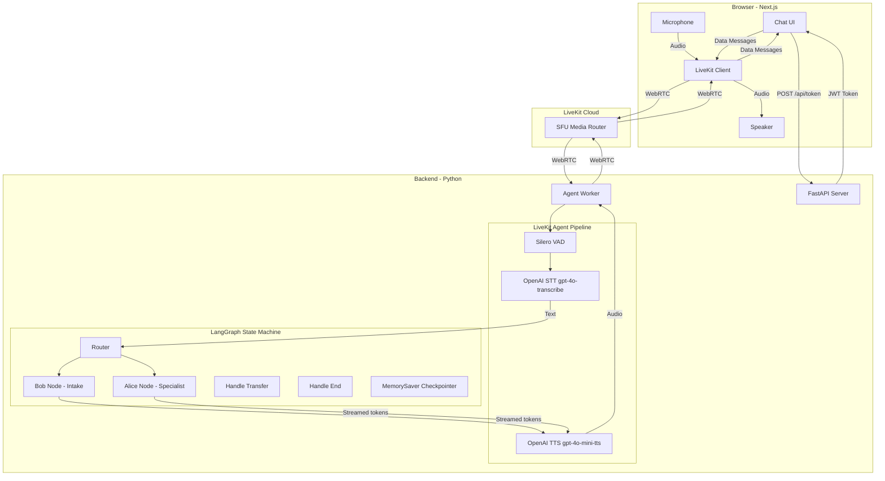
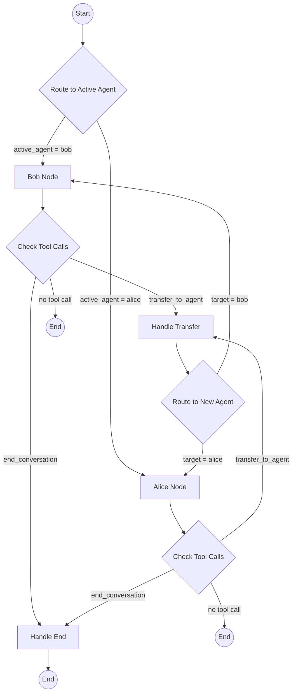
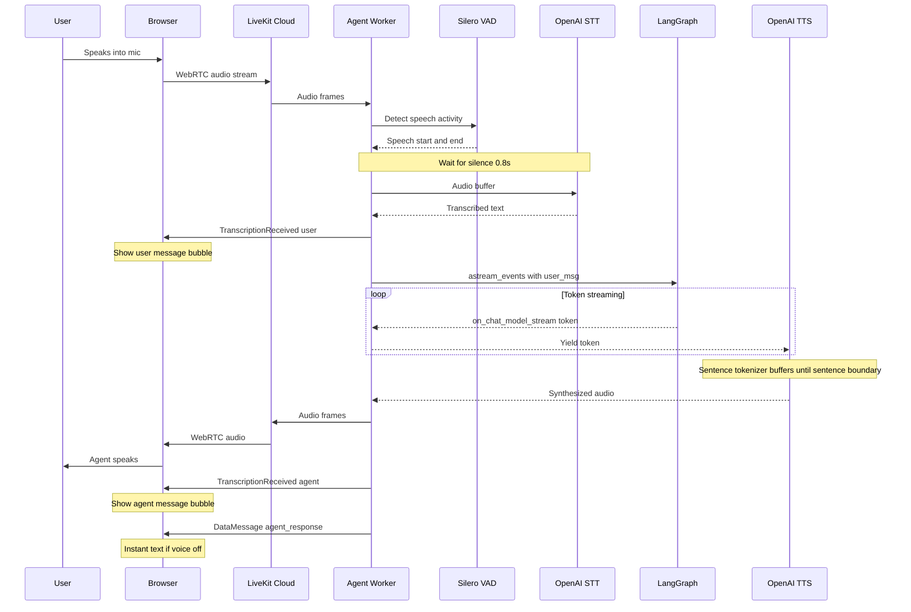
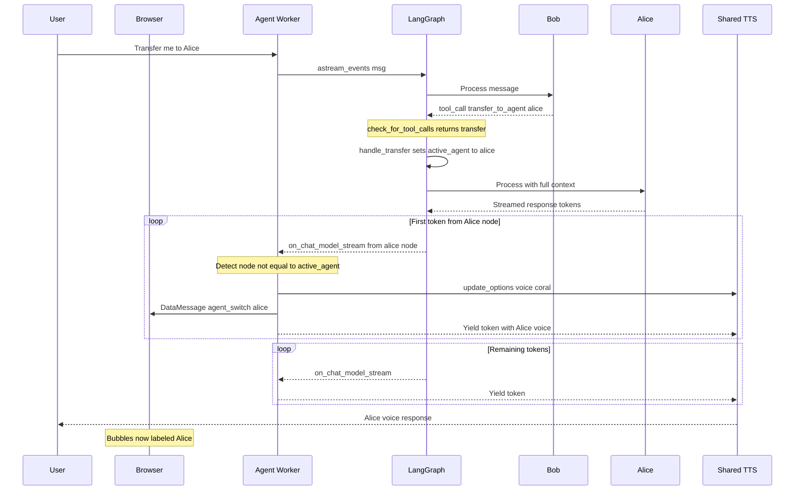
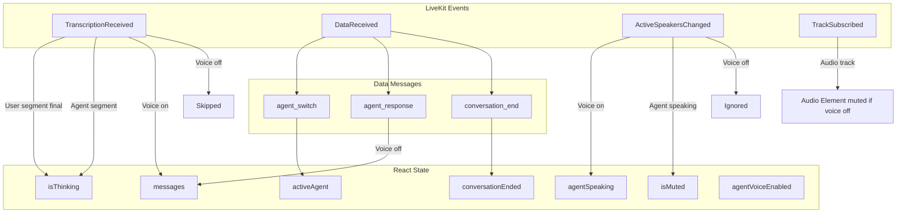
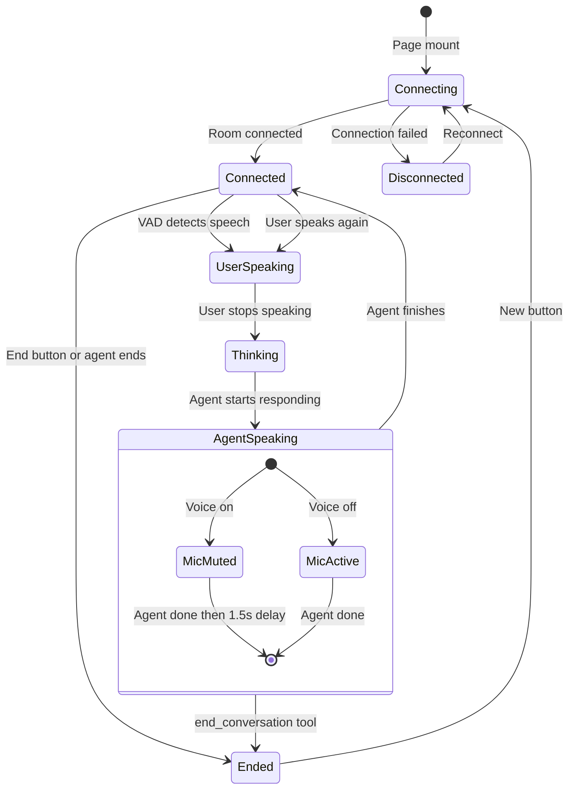

# Architecture Diagrams

## System Overview

```mermaid
graph TB
    subgraph Browser["Browser - Next.js"]
        UI[Chat UI]
        LC[LiveKit Client]
        MIC[Microphone]
        SPK[Speaker]
    end

    subgraph LK["LiveKit Cloud"]
        SFU[SFU Media Router]
    end

    subgraph Backend["Backend - Python"]
        AW[Agent Worker]
        API[FastAPI Server]

        subgraph Pipeline["LiveKit Agent Pipeline"]
            VAD[Silero VAD]
            STT["OpenAI STT gpt-4o-transcribe"]
            TTS["OpenAI TTS gpt-4o-mini-tts"]
        end

        subgraph Graph["LangGraph State Machine"]
            Router[Router]
            BobN["Bob Node - Intake"]
            AliceN["Alice Node - Specialist"]
            Transfer[Handle Transfer]
            EndNode[Handle End]
            CP[MemorySaver Checkpointer]
        end
    end

    MIC -->|Audio| LC
    LC -->|WebRTC| SFU
    SFU -->|WebRTC| LC
    SFU -->|WebRTC| AW
    AW -->|WebRTC| SFU
    AW --> VAD --> STT
    STT -->|Text| Router
    Router --> BobN
    Router --> AliceN
    BobN -->|Streamed tokens| TTS
    AliceN -->|Streamed tokens| TTS
    TTS -->|Audio| AW
    LC -->|Audio| SPK
    UI -->|Data Messages| LC
    LC -->|Data Messages| UI
    UI -->|POST /api/token| API
    API -->|JWT Token| UI
```

## LangGraph Agent Flow

```mermaid
graph TD
    START((Start)) --> Route{Route to Active Agent}
    Route -->|"active_agent = bob"| Bob[Bob Node]
    Route -->|"active_agent = alice"| Alice[Alice Node]

    Bob --> Check1{Check Tool Calls}
    Alice --> Check2{Check Tool Calls}

    Check1 -->|transfer_to_agent| HandleTransfer[Handle Transfer]
    Check1 -->|end_conversation| HandleEnd[Handle End]
    Check1 -->|no tool call| END1((End))

    Check2 -->|transfer_to_agent| HandleTransfer
    Check2 -->|end_conversation| HandleEnd
    Check2 -->|no tool call| END2((End))

    HandleTransfer --> Route2{Route to New Agent}
    Route2 -->|"target = bob"| Bob
    Route2 -->|"target = alice"| Alice

    HandleEnd --> END3((End))
```

## Voice Pipeline - Single Turn

```mermaid
sequenceDiagram
    participant User
    participant Browser
    participant LiveKit as LiveKit Cloud
    participant Worker as Agent Worker
    participant VAD as Silero VAD
    participant STT as OpenAI STT
    participant Graph as LangGraph
    participant TTS as OpenAI TTS

    User->>Browser: Speaks into mic
    Browser->>LiveKit: WebRTC audio stream
    LiveKit->>Worker: Audio frames
    Worker->>VAD: Detect speech activity
    VAD-->>Worker: Speech start and end

    Note over Worker,STT: Wait for silence 0.8s

    Worker->>STT: Audio buffer
    STT-->>Worker: Transcribed text

    Worker->>Browser: TranscriptionReceived user
    Note over Browser: Show user message bubble

    Worker->>Graph: astream_events with user_msg

    loop Token streaming
        Graph-->>Worker: on_chat_model_stream token
        Worker-->>TTS: Yield token
    end

    Note over TTS: Sentence tokenizer buffers until sentence boundary

    TTS-->>Worker: Synthesized audio
    Worker->>LiveKit: Audio frames
    LiveKit->>Browser: WebRTC audio
    Browser->>User: Agent speaks

    Worker->>Browser: TranscriptionReceived agent
    Note over Browser: Show agent message bubble

    Worker->>Browser: DataMessage agent_response
    Note over Browser: Instant text if voice off
```

## Agent Transfer Flow

```mermaid
sequenceDiagram
    participant User
    participant Browser
    participant Worker as Agent Worker
    participant Graph as LangGraph
    participant Bob
    participant Alice
    participant TTS as Shared TTS

    User->>Worker: Transfer me to Alice
    Worker->>Graph: astream_events msg

    Graph->>Bob: Process message
    Bob-->>Graph: tool_call transfer_to_agent alice

    Note over Graph: check_for_tool_calls returns transfer

    Graph->>Graph: handle_transfer sets active_agent to alice

    Graph->>Alice: Process with full context
    Alice-->>Graph: Streamed response tokens

    loop First token from Alice node
        Graph-->>Worker: on_chat_model_stream from alice node
        Note over Worker: Detect node not equal to active_agent
        Worker->>TTS: update_options voice coral
        Worker->>Browser: DataMessage agent_switch alice
        Worker-->>TTS: Yield token with Alice voice
    end

    loop Remaining tokens
        Graph-->>Worker: on_chat_model_stream
        Worker-->>TTS: Yield token
    end

    TTS-->>User: Alice voice response
    Note over Browser: Bubbles now labeled Alice
```

## Frontend Data Flow

```mermaid
graph TD
    subgraph LiveKitEvents["LiveKit Events"]
        TS[TranscriptionReceived]
        DR[DataReceived]
        AS[ActiveSpeakersChanged]
        TC[TrackSubscribed]
    end

    subgraph DataMessages["Data Messages"]
        AgentSwitch[agent_switch]
        AgentResponse[agent_response]
        ConvoEnd[conversation_end]
    end

    subgraph ReactState["React State"]
        Messages[messages]
        ActiveAgent[activeAgent]
        IsThinking[isThinking]
        AgentSpeaking[agentSpeaking]
        IsMuted[isMuted]
        ConvoEnded[conversationEnded]
        VoiceEnabled[agentVoiceEnabled]
    end

    TS -->|User segment final| IsThinking
    TS -->|Agent segment| IsThinking
    TS -->|Voice on| Messages
    TS -->|Voice off| Skip[Skipped]

    DR --> AgentSwitch --> ActiveAgent
    DR --> AgentResponse -->|Voice off| Messages
    DR --> ConvoEnd --> ConvoEnded

    AS -->|Voice on| AgentSpeaking
    AS -->|Agent speaking| IsMuted
    AS -->|Voice off| Ignore[Ignored]

    TC -->|Audio track| AudioEl["Audio Element muted if voice off"]
```

## Conversation State Machine

```mermaid
stateDiagram-v2
    [*] --> Connecting : Page mount
    Connecting --> Connected : Room connected
    Connecting --> Disconnected : Connection failed

    Connected --> UserSpeaking : VAD detects speech
    UserSpeaking --> Thinking : User stops speaking
    Thinking --> AgentSpeaking : Agent starts responding
    AgentSpeaking --> Connected : Agent finishes

    Connected --> UserSpeaking : User speaks again

    state AgentSpeaking {
        [*] --> MicMuted : Voice on
        [*] --> MicActive : Voice off
        MicMuted --> [*] : Agent done then 1.5s delay
        MicActive --> [*] : Agent done
    }

    Connected --> Ended : End button or agent ends
    AgentSpeaking --> Ended : end_conversation tool

    Ended --> Connecting : New button
    Disconnected --> Connecting : Reconnect
```
